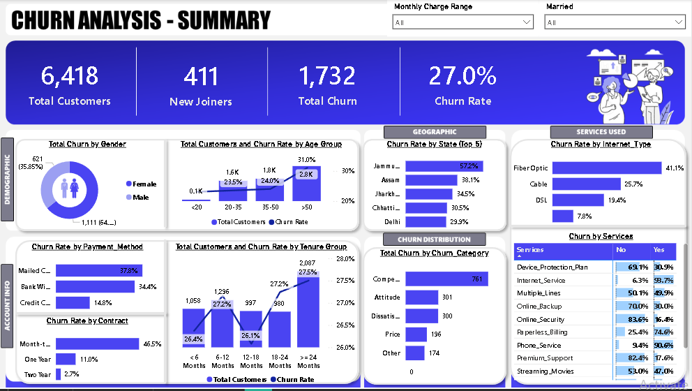
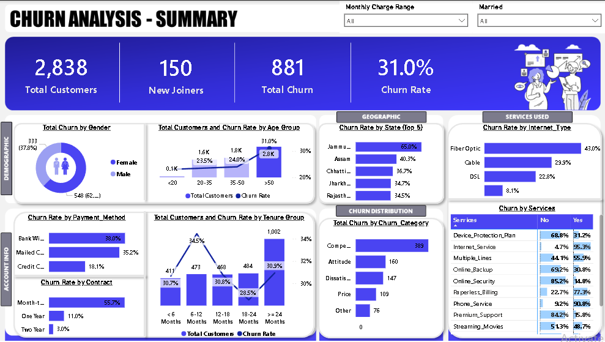
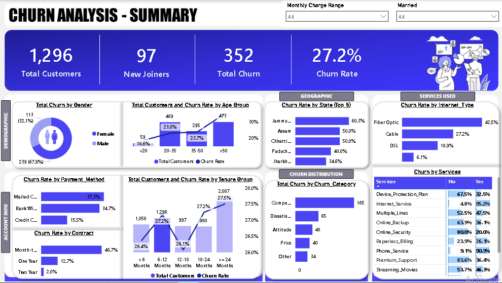
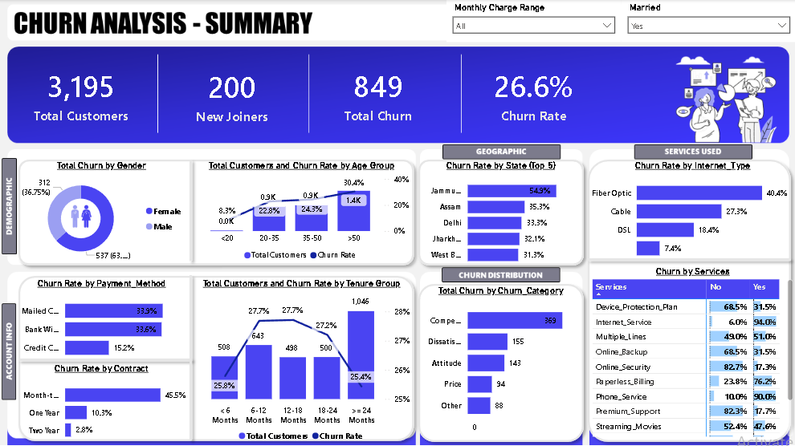

# 📊 Customer Churn Analytics Dashboard

## Project Objective

To analyze customer churn patterns and identify factors influencing customer retention using Power BI. The dashboard helps businesses understand customer behavior and improve retention strategies.

---

## Project Overview

This Power BI Customer Churn Analytics Dashboard provides insights into customer demographics, churn trends, contract types, payment methods, internet services, and customer tenure. Interactive filters allow users to explore key factors contributing to customer attrition.

---

## Key Features

- Customer Churn Analysis
- Customer Retention Insights
- Churn Rate Monitoring
- Gender-wise Churn Analysis
- Senior Citizen Analysis
- Contract Type Analysis
- Payment Method Analysis
- Internet Service Analysis
- Monthly Charges Analysis
- Interactive Filters and Slicers

---

## Tools Used

- Power BI
- Power Query
- DAX
- Excel

---

## Dashboard Preview

### Summary Dashboard

### Detailed Analysis

### Customer Segmentation

### Retention Analysis

---

## Files Included

- Churn_Analysis_Dashboard.pbix
- Customer_Churn_Analytics_Dashboard.mp4
- Dashboard Screenshots

---

## Skills Demonstrated

- Data Cleaning
- Data Modeling
- DAX Calculations
- Customer Analytics
- KPI Reporting
- Dashboard Design
- Data Visualization
- Interactive Reporting

---

## Business Insights

- Customers on month-to-month contracts showed significantly higher churn rates.
- Customers with longer tenure demonstrated stronger retention.
- Certain payment methods were associated with higher churn percentages.
- Higher monthly charges correlated with increased customer churn.
- Fiber-optic internet customers experienced comparatively higher churn rates.
- Long-term contracts contributed positively to customer retention.

---

## Future Enhancements

- Customer Lifetime Value Analysis
- Churn Prediction using Machine Learning
- Customer Segmentation Dashboard
- Cohort Analysis
- Retention Forecasting

---

## Conclusion

This dashboard demonstrates how Power BI can uncover customer retention trends and help businesses reduce churn through data-driven decision-making.
